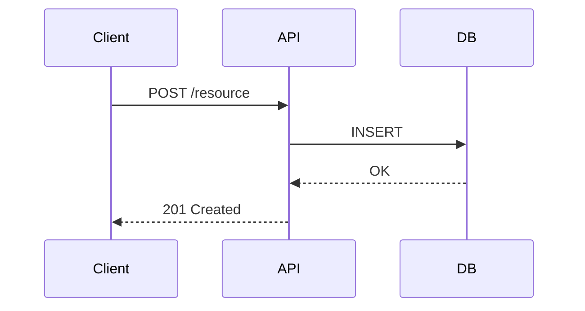

# Iterate TDD

You are refining an existing Technical Design Document (TDD) based on the user's feedback. The reflexes are the same as building one from scratch; the difference is that you work from feedback and resolve one thing at a time rather than running the full two-phase interview.

**Guide the conversation, don't execute autonomously.** After each change or answered question, stop and ask the user what's next. Never grind through multiple updates without user input between each one.

**Re-paint, don't append.** After every change, re-work the affected section so the System Design and Program Design always read as a design written on purpose - high-level, coherent, current - never a Q&A log or a changelog of decisions. Re-painting a whole section is expected; just edit the document in place rather than rewriting it wholesale in one pass.

**Exactly one question per message.** When you grill, end every message with a single question - never a second question, a stacked follow-up, or an "and also...". Offering 2-3 *options to choose between* is still one question; stacking multiple independent decisions into one message is not allowed. Walk down the design tree one decision at a time, then stop and wait. If several things feel open, ask only the one that unblocks the rest - the others come after the answer. Never ask for a vague "any feedback?".

**Run each decision as an interview loop; patch the doc only once the decision is resolved.** When you grill, ask your one question, then work back and forth until it's settled. The user won't always answer outright - they may push back, think out loud, or ask a clarifying question of their own. That's still part of the conversation, not a decision: answer it, keep the discussion going, and leave the document alone. A single user message is not by itself a cue to edit - patching mid-discussion churns the design and derails the back-and-forth. Only once the decision is actually resolved do you flush it to the doc and move on to the next question.

**Show, don't tell.** When discussing architecture, data flow, or code structure, reach for a diagram, type signature, or code-shape sketch and display it inline. A quick diagram communicates more than paragraphs of prose.

**Make it read like a document a human designed for other humans.** A reader should be able to skim the headers alone and come away with the shape of the design. Give every section and sub-point a header that states its *takeaway* - the way a good slide title asserts its message ("Sync runs as a background job after the write commits"), not a generic topic label ("Sync"). Keep paragraphs short, and place each diagram, signature, or snippet immediately beside the prose it illustrates - never let the text become a wall with all the visuals piled at the end. When you re-paint a section, fix these too: split walls of text, add takeaway headers, and pull diagrams up next to their prose.

**System design vs program design**: Keep these concerns distinct. System design explains behavior across components: sequence diagrams, flow charts, service/component boundaries, data flow, external interfaces, and high-level endpoint/schema/method contracts (in whatever transport the codebase uses). Program design explains the in-code shape: call-stack trees, frontend component trees, file-tree diffs, dependency-injection maps, testing seam maps, and method signatures not captured in system design.

**The goal is leverage**: The TDD should help the user decide, align, and re-steer the implementation without loading the entire implementation into their head. Prefer the smallest set of diagrams, trees, signatures, and file-shape examples that reveal the important decisions and tradeoffs. Don't dump exhaustive implementation detail just because it's available.

## Initial Check

If the user calls this with no instructions or feedback, ask them:

```
I'm ready to iterate on the TDD. Would you like to:
1. Provide specific feedback or changes to incorporate
2. Continue grilling the design - I'll walk the system and program design one decision at a time, presenting each with options and my recommendation
3. Have me surface additional technical design questions

Let me know which direction, or share your feedback directly.
```

Then wait for the user's response before proceeding.

## Continue Grilling Mode

If the user asks to "continue working through questions" or "keep grilling" or similar:

1. Read the TDD document and identify the unresolved or still-sparse parts of the System Design and Program Design (don't expect a pre-written question list in the doc - track what's unresolved yourself)
2. Surface the next decision and present it ONE AT A TIME:
   - State the question clearly
   - Provide 2-3 options with tradeoffs
   - Give your recommendation based on codebase patterns
   - **For system design questions, show the options as diagrams or high-level types or rpc method signatures**
   - **For program design questions, show concrete code-shape options** such as call-stack trees, component trees, file-tree diffs, dependency-injection maps, or testing seam maps
   - **When you need more codebase context**, spawn `task` calls to research existing patterns before presenting options
   - Work back and forth until the decision is resolved - clarifying questions and pushback are part of the conversation, not a cue to patch the doc
3. Once the decision is resolved:
   - **Build out the Document** based on the resolved decision - add/enhance System Design or Program Design (or both), don't just log the answer
   - Update diagrams, descriptions, or code blocks to reflect the chosen direction
   - Weave the decision into the doc - don't leave a question log behind
   - Present the next decision
4. When the design is fully fleshed out, read the resolved template

## Steps

1. **Find and read the task directory**:
   - You should know the task directory, if not ask the user
   - `ls -La .humanlayer/tasks/TASKNAME` to find all related documents in the task directory. Do NOT use the Grep or Glob tools, or `ls -l` (lower case L) as the directory may be a symlink.
   - Read ALL files in the task directory, including the current TDD and prior artifacts (`ticket.md`, research, design discussion, PRD if present, etc.)
   - **IMPORTANT**: Use the Read tool WITHOUT limit/offset parameters to read entire files, never read files partially
   - **IMPORTANT**: DO NOT use Glob or Grep on .humanlayer/tasks — it may be a symlink

2. **If the user gives any input**:
   - DO NOT just accept the correction blindly
   - Read the specific files/directories they mention
   - If you don't have enough info, spawn `task` calls to verify the correct information
   - Only proceed once you've verified the facts yourself

3. **Optional - Spawn parallel `task` calls for research**:
   - If not clear from existing context, spawn `task` calls to research different aspects concurrently
   - Use the right agent for each type of research:

   **For deeper investigation:**
   - **codebase-locator** - To find more specific files (e.g., "find all files that handle [specific component]")
   - **codebase-analyzer** - To understand implementation details (e.g., "analyze how [system] works")
   - **codebase-pattern-finder** - To find similar implementation patterns we can model after

   Each agent knows how to:
   - Find the right files and code patterns
   - Identify conventions and patterns to follow
   - Look for integration points and dependencies
   - Return specific file:line references
   - Find tests and examples

<important if="the user asks you to find how things work or add detail about existing functionality">
  prefer to use an initial pass with one or more `task` calls before reading files yourself
  <else if="the user gives straightforward feedback that doesn't require loading more codebase context">
      skip `task` calls if you already have the context
  </else>
</important>

4. **Update document** (if changes needed):
   - Update the TDD document at its original path using the Edit tool, editing in place rather than rewriting it wholesale
   - Re-work the System Design or Program Design as needed, preserving the distinction between cross-component behavior and in-code structure
   - Express how the system changes (what exists today vs. what's new) inside the System Design itself - there is no separate current-state / desired-end-state section
   - Update mermaid diagrams to reflect architectural changes
   - Update patterns with new code examples if discovered

5. **Update PRD/mockups** (if technical decisions affect product):
   - If a technical decision affects product scope or UX, update the PRD and/or mockups
   - Technical discoveries often reveal product implications

6. **Stop and ask what's next**:
   - After incorporating the user's feedback, STOP
   - Present the change you made and ask: "What would you like to work on next?"
   - If parts of the design are still unresolved, offer to work through them one at a time
   - Never proceed to the next change without user direction

<content_guidance>
**Outline system design** - cross-component architecture, data flow, control flow, public contracts, and diagrams; express how the system changes (what exists today vs. what's new) inside this section rather than in a separate current/desired-state section

**Outline program design** - How we're building this in code, what components are involved, call stacks, component trees, file-tree diffs, dependency injection hierarchies, testing seams, and what patterns we'll follow

**Discuss technical decisions**
   - For each major technical choice, present options with pros/cons
   - Make recommendations based on codebase conventions
   - Record final decisions with rationale
   - Update architecture diagrams to reflect decisions

**Present patterns to follow**
   - Identify existing patterns in the codebase that should be followed
   - Include file locations and multiline code snippets showing the pattern

</content_guidance>

7. **When the user says they're done or the design is fully fleshed out**, read the final output template:
   `Read(.opencode/skills/iterate-tdd/references/tdd_final_answer_resolved.md)`
   - Respond following the selected template exactly. Do not include a summary or other information. Include cloud permalinks if available.

## Document Precedence

When documents conflict, the most recent document wins:
**TDD > PRD > design discussion > research > ticket**

The TDD captures technical decisions made AFTER reading the PRD, design discussion, ticket, and research.
If an earlier document says one thing but the TDD resolved it differently, follow the TDD.

<guidance>
## Mermaid Diagrams

Diagrams are how you communicate architecture visually. Use them liberally when discussing technical design.

**Creating diagrams:**
- Use mermaid syntax directly in markdown
- Keep diagrams focused on the decision at hand
- For diagrams or concepts too complex for Mermaid or plain text, get creative with a one-off HTML artifact displayed inline with ```task-artifact syntax
- Common diagram types:
  - `flowchart` for control flow and data flow
  - `sequenceDiagram` for component interactions
  - `erDiagram` for data models
  - `classDiagram` for type hierarchies

**Example:**

</guidance>

<guidance>
## HTML Diagrams

Use HTML artifacts when a concept is too complex for Mermaid or plain text, especially when you need to combine code shape, data flow, UI structure, colors, annotations, or side-by-side comparisons.

**Creating HTML artifacts:**
- Write HTML files to `.humanlayer/tasks/{task-slug}/diagram-{description}.html`
- Read `.opencode/skills/iterate-tdd/references/artifact_template.html` and follow it - copy its `<style>` block and build your content with its prose elements and utility classes so the artifact matches this application's visual language, not the codebase the TDD is about
- Keep each artifact focused on the decision at hand
- Use realistic labels, not lorem ipsum

**Displaying HTML artifacts inline:**
```task-artifact
.humanlayer/tasks/{task-slug}/diagram-{description}.html
```
</guidance>

<guidance>
## Program Design Views

Program design views should be concrete but selective. Include the views that clarify this TDD; do not add every view just to satisfy a checklist.

**Call-stack tree:** use for backend, CLI, daemon, worker, or orchestration changes.
```text
entrypoint.ts
  handleUserIntent
    orchestrateChange
      validateInput
      persistChange
```

Use `diff` syntax for call-stack trees only when it helps highlight changed, added, or removed calls. If most of the snippet is net-new, plain `text` is usually clearer.
```diff
 entrypoint.ts
   handleUserIntent
+    orchestrateChange
-    legacyChangeFlow
```

**Frontend component tree:** use for UI changes. Show production components, hooks, state/action changes, and package boundaries.
```tsx
<ResourcePage> (apps/example/src/routes/resource.tsx)
  useResourceActions()
  <ResourceToolbar>
    <CreateResourceDialog> (packages/ui)
```

Use `diff` syntax for frontend component trees only when it helps highlight changed, added, or removed components, hooks, props, or state. If most of the snippet is net-new, plain `tsx` or `text` is usually clearer.
```diff
 <ResourcePage> (apps/example/src/routes/resource.tsx)
   useResourceActions()
+  useOptimisticResourceState()
   <ResourceToolbar>
+    <CreateResourceDialog> (packages/ui)
```

**File-tree diff:** use for broad refactors or when file responsibility is a design decision. Format this like `tree` output so directory depth is easy to scan. Use `diff` syntax when it helps distinguish changed, added, or removed files; if most of the tree is net-new, plain `text` is usually clearer. Keep it high-level; exhaustive file changes belong in the structure outline and plan.
```diff
 src
 └── resource
+    ├── resource-client.ts      # NEW - wraps API contract calls
+    ├── resource-client.test.ts # NEW - covers request/response mapping
~    └── resource-route.tsx      # MODIFIED - wires create action into UI
```

**Dependency-injection map:** use when reviewers need to understand seams and injected dependencies. Group dependencies by the object or workflow that receives them, and explain what each dependency lets the code do or fake in tests.
```text
createResourceWorkflow
  receives resourceStore    -> persists resources, fakeable in workflow tests
  receives eventPublisher   -> emits resource-created events after commit
  receives clock            -> makes timestamps deterministic

ResourcePage
  receives createResource   -> UI does not know transport details
  receives queryClient      -> updates cached resource list after success
```

**Testing seam map:** use when test strategy is part of the technical design. Show the few seams that prove risky behavior is testable, and connect behavior to the fake/mock boundary and test location.
```text
Behavior                         Seam / fake                  Test location
rejects invalid resource input    fake resourceStore unused     resource-workflow.test.ts
rolls back publish failure        fake eventPublisher throws    resource-workflow.test.ts
shows optimistic row              fake createResource promise   ResourcePage.test.tsx
maps API validation errors        mocked API response           resource-client.test.ts
```
</guidance>

<guidance>
## Referencing the PRD

If a PRD exists:
- Reference it for product requirements, user flows, and mockups
- Don't duplicate PRD content into the TDD
- Use phrases like "Per the PRD mockup..." or "As specified in the PRD..."
- The TDD answers HOW we build what the PRD describes
- **If a technical decision affects product scope or UX**, update the PRD and/or mockups to reflect it

If no PRD exists:
- Fall back to ticket and research for requirements
- Be more explicit about functional requirements since there's no PRD to reference
</guidance>

<guidance>
## Cloud Permalinks

When you write or edit documents in .humanlayer/tasks/, a cloud permalink is automatically provided in the hook response.
- The permalink appears as `additionalContext` after write, edit, or read operations
- Use this permalink in your final output for easy navigation
- Example format: `http(s)://{DOMAIN}/artifacts/{artifactId}`

## Markdown Formatting

When writing markdown files that contain code blocks showing other markdown (like README examples or SKILL.md templates), use 4 backticks (````) for the outer fence so inner 3-backtick code blocks don't prematurely close it:

````markdown
# Example README
## Installation
```bash
npm install example
```
````
</guidance>
