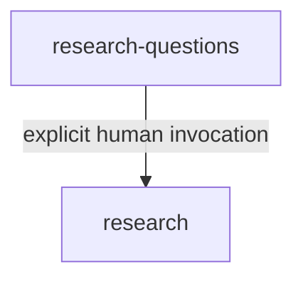
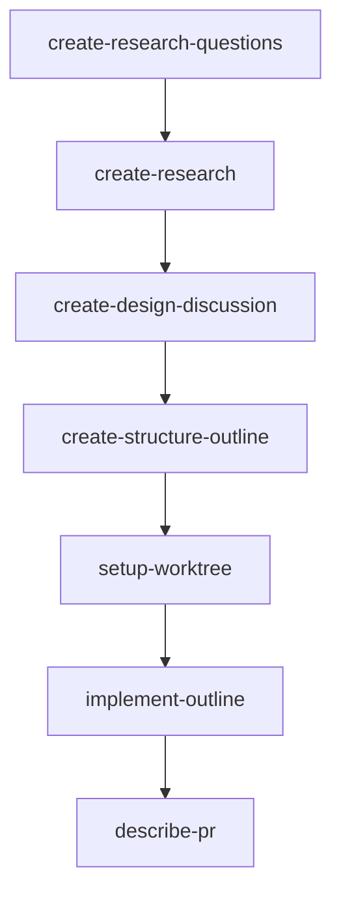
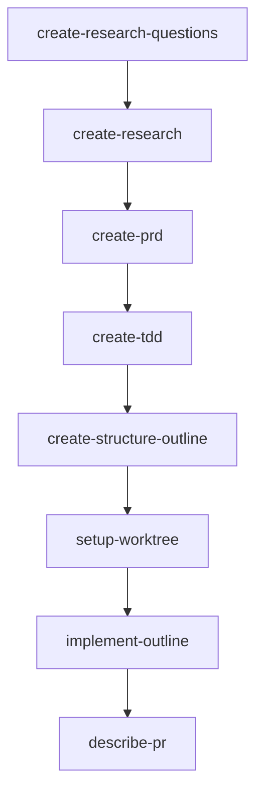

# Architecture-First Engineering Workflows

The independent OpenCode distribution lives directly under [`skills/`](skills/) and [`agents/`](agents/). Existing skills under `.opencode/`, `.agents/`, and `matt-skills/` are unchanged source material, not runtime dependencies of the independent suite.

The delivered RPI Evidence entry path is:

`research-questions` creates a neutral Research packet and stops. Only `research` authorizes the isolated `research-worker`, publishes canonical Evidence, names `product-design` as the downstream suite phase, and stops. The downstream skill is delivered by a separate slice.

Shared model-invoked primitives are `grilling`, `domain-modeling`, `prototype`, `codebase-design`, and `tdd`.

## Source Workflows

Each step names the skill to run. Complete one skill before starting the next.

[Guide Skills-Workflosw](https://docs.humanlayer.com/guide/skills-workflows)
[Reference Skills-Workflosw](https://docs.humanlayer.com/reference/skills-workflows)

## Design Discussion Workflow

## PRD and TDD Workflow

