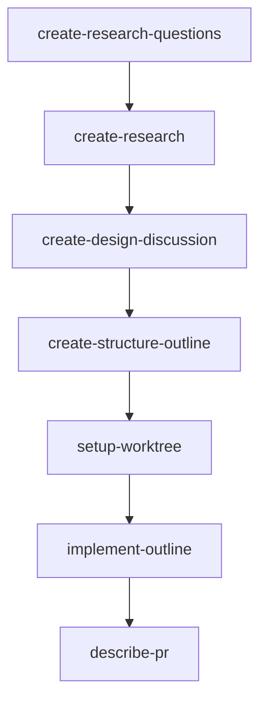
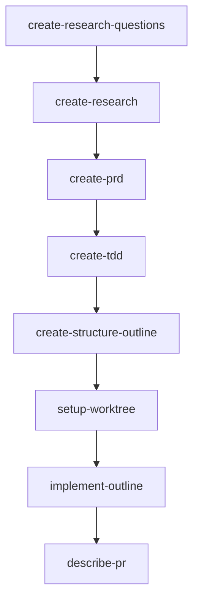

# RPI Workflows

Each step names the skill to run. Complete one skill before starting the next.

[Guide Skills-Workflosw](https://docs.humanlayer.com/guide/skills-workflows)
[Reference Skills-Workflosw](https://docs.humanlayer.com/reference/skills-workflows)

## Design Discussion Workflow

## PRD and TDD Workflow

